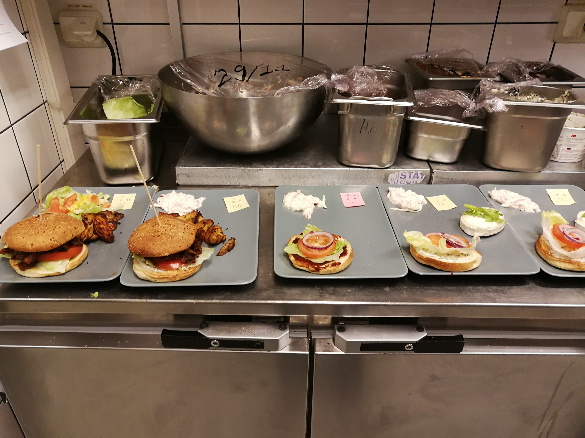
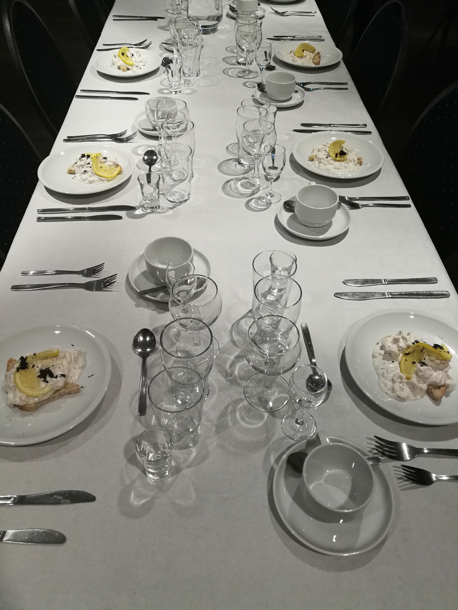
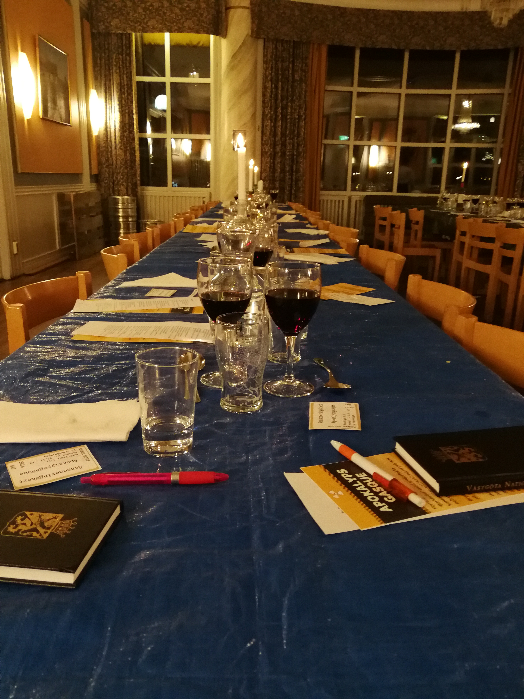

贴一些以前当Uppsala Unversity学生大使时写的一些文章。

【分割线】

------------------------------------------------
乌村是个学生城，来之前就听说这里打工僧多粥少还要求瑞典语。

但乌村还有nation。

<!--more-->

Facebook的group功能，基本每个nation都会有自己的群组发布available shift和相应时间，然后私信或者评论发布者说明就可以了。

一般来说，去nation打工没有限定一周要去几次，想去就去找空缺的职位，相应的负责人确认后会登记。如果当天临时有事去不了提前24小时或48小时告诉负责人，或者自己找其他人来接替。临时翘班影响很不好的哦。

当然玩得开的同学可以大胆地在nation的时候直接问，大家都会很乐意告诉你。

所有的nation都包括pub，fika(brunch)，rental(gasque)三大块。
pub分为厨房，吧台，服务生。服务生的工作又可分为dish washer，wardrobe，server，但一般这三者是轮换来的。吧台主要是收银和酒水，有时候会涉及到一些特调酒水的制作。另外吧台和wardrobe的工作有和顾客交流最多的机会，尤其是吧台。pub都是晚上开，工作结束会到凌晨12点到1点，但是有的nation会在pub结束后组织个小聚会，p.s.可以喝酒。

汉堡流水线

rental里的工作有相对其他两者稍高一点的工资，但同时工作量也大了许多。而且因为是类似宴会性质，很多环节都有很神奇的要求。比如倒红酒的时候不能把瓶里最后一滴倒出来再换另一瓶，当预感这一瓶不够一杯时就换。再比如瑞典有很严格的限酒令，超过一定酒精度数的酒只能在酒局出售，而且对售酒人员也有严格要求，不能向醉酒者售酒（只要你看起来对方是醉的），不能向不在座位的人售(倒)酒。Gasque是一个很有意思的瑞典传统，酒水与食物有严格的顺序，间隔的时候大家还会一起唱歌玩游戏。从工作者的角度来参与，感触最深的是，每次快结束的时候，所有服务生会一起上台，接受所有宾客的感谢，有时候唱歌，有时候鼓掌，然后我们鞠躬。这里大家都是平等的，大家也都很好说话。

餐具有严格的摆放顺序

Naiton的Fika(Brunch)是周末的特色，据说这边默认大家周五或周六晚上会疯狂party，然后周末早上不起直接去吃brunch。Fika类似cafe，甜品三明治居多，不过不同nation会不定期举办主题fika，比如indian fika，Indonesia fika， japanese fika等等，Chinese fika见的很…少。小编没有去Fika工作过，听说没有分具体职务，当天工作的小伙伴负责全部。不过基于nation充足的设备条件，有很多机会做甜点哦。
	
Nation把自家的工作当作学生课余活动的一部分，只是兼带赚点零花钱，所以工资都很低（有的甚至没有）。而去nation工作的也全部是学生。有一个不确定自己要学什么的瑞典人，处于高中毕业到大学之间的gap year，在厨房工作的那次，他和我和另一个学药学的小姐姐聊了很久的专业。他说他想从这个专业的学生里，听听这个专业真实的样子。后来他有理有据的说出他对人工智能的见解和怀疑，我觉得他快想通了。有几个都是来自nation Quidditch Team（对没错是哈利波特的魁地奇比赛）的小伙伴，他们来nation免费打工是为了完成任务然后nation可以给他们队资助。当然也有不少需要赚零花钱的学生们。但相对来说比外面自由一些，没有瑞典语的限制，很多事情都会教你怎么去做。Nation更像一个由人际联系起来的小型社会，你见过的很多人还会在其他场合见到，久了你就会觉得自己是这里的一份子，就好比刚开始的时候你问其他人为什么加入这个nation，他们大部分都会答“因为我的朋友们加了这里。”

p.s.：大部分nation工作都是要求人口号的，因为发工资是用瑞典当地银行卡。

pps：nation打工可以是体验生活的一种方式，重点还是学业为主。
