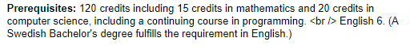

贴一些以前当Uppsala Unversity学生大使时写的一些文章。

【分割线】

------------------------------------------------
又要到新学期了，今天我们来聊一聊如何在乌普萨拉大学选课。

<!--more-->

选课系统
整个瑞典有个选课系统，和申请学校时的一样，可以看到瑞典所有学校的课程。都在https://www.universityadmissions.se/. 其实这个英文版网站是面向国际学生的，而https://www.antagning.se/se/ 是面向瑞典学生，而且网站只有瑞典文。根据小编的经历，选课申请在两个网站并没有区别（因为选课时你已经注册为瑞典大学的学生），但前者通常只会显示本专业内可选课程，后者会显示其他学院的课程会更多，而其中的重要原因就是先修课体系。

提交选课申请的时候可以选择多门课程，审核后会显示admission或unqalified，然后让你再次确认。

但各个学院的选课方式又有不同。小编在Language technology program 下的课程是在第一节课的时候，由学院代为注册，但ITC 学院的课程需要去上面网址，在截止日期前申请，所以大家在选课前一定要了解清楚。最重要的是毕业的学分要求，在满足毕业所需必修课和选修课分数之外，再考虑跨专业跨学院选课。

课程体系
和专业申请一样，瑞典大学的选课有严格的先修课程要求，不满足时会被unqualified，对于跨专业选课时更是如此。以Artificial Intelligence 为例：

这个课程要求120 credits， 基本就是硕士生才可以选的课（本科毕业是120 credits），此外还要求15 credits的数学和20 credits的编程。 如果大家专业申请的要求已经涵盖了这些课程的分数，基本就是没有问题的。不然就要注意自己算一算。

例外情况有两种，第一，如果课程包括在本专业的课程计划内，先修学分要求可能会不一样（以本专业的课程计划页为主）；第二，如果申请的课程被unqualified了，而你在本科修过满足要求的分数或者相应的课程，可以进行argue，最直接的方式就是找课程所在学院的studievagledare。

Studievagledare 翻译成英文是student advisor, 各个学院都有，有的学院和coordinator合并为同一人。从职能上来说类似国内的辅导员，但更重要的是偏重学生的学习规划和咨询，协调选课。面谈时间可以在学院的网站上预约，也可以在网上公布的drop-in时间里直接去。

课程设置
在每个课程的syllabus里，你还需要关注这些：
	• 在瑞典，全日制（约为40 小时每周的学习时间）要求每学期30 credits，因此每学期的学费也是交的30 credits。对于欧盟区外的自费学生来说，多选课是不允许的（除非多出部分按学分交钱）。如果你在网站上看到有15 credits free-standing course这一说法，这是针对欧盟学生的。
	
	• 瑞典学期分两个小学期（period），大部分课程在一个小学期末结束并考试，个别高学分的课会跨整个学期。每个课程的学分考虑了所需的学习时间，包括了课堂、作业、课下阅读 、考试等等。所以理想的课程安排是每个小学期15学分。如果有想选课程大量重叠的情况，要量力而为。
	
	• 申请截止时间。过了截止时间如果还想申请，还可以去找Studievagledare。

关于退课
在刚开始的一段时间内，如果对所选课程不满意是可以进行退课的，时间甚至有三周到一个月之久。但鉴于国际学生的选课不是很灵活，如果没有备选的课程，这里仍然不建议。
	
	

